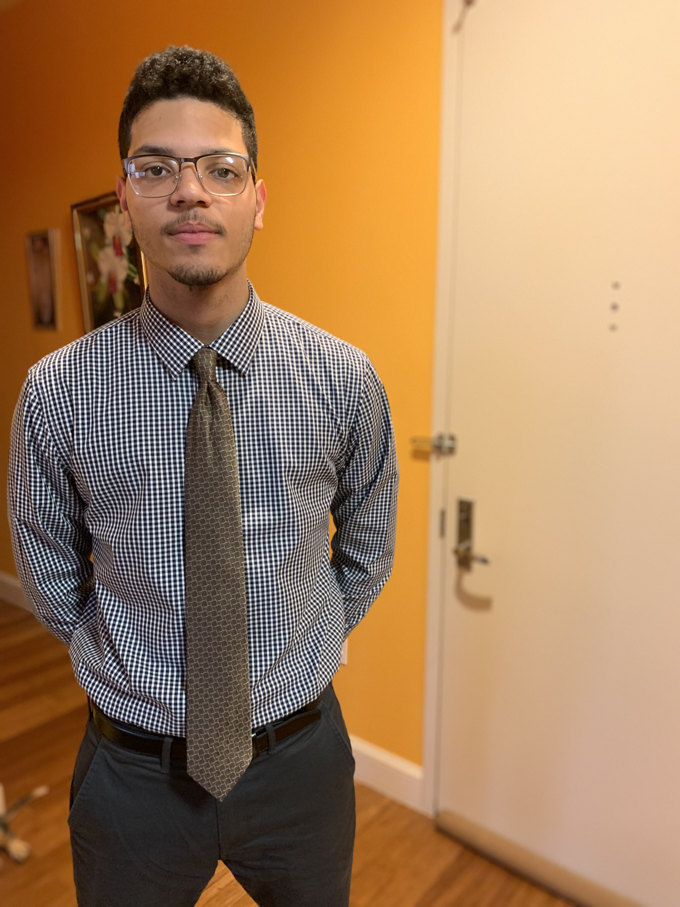

I am currently pursuing my undergraduate degree in Computer Science. Throughout my undergrad career, I’ve taken courses like Database Design (Spring 2020), Software Engineering (Fall 2020), Projects (Fall 2021), and Web Programming (Fall 2021). Currently, I am taking Advanced Web Server Program and Web Development. In the previous courses, I’ve built three major projects including a grocery store’s point of sale system, an expert system/search engine for Medicinal Plants, and a Fitness Tracker application. On my own, I’ve also practiced building static and dynamic pages/applications with the help of LinkedIn and YouTube courses.  
From this course, I hope to increase my knowledge on Vue, learn and practice advanced backend development with Node and Express, and overall build a better application than my previous projects. At the moment, my professional goal is to pursue a career in Front End development after graduating however, I’m also interested in finding a Full Stack job if possible. I see this course as a learning opportunity that will get me one step closer to feeling prepared for a job in Full Stack or even Front End.

